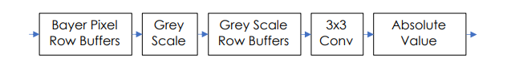

# 2D Image Processing Module
For more details, see: [Lab2-MainDocument.pdf](Lab2-MainDocument.pdf).  
Lab Report: [Minilab_2_Report.pdf](Minilab_2_Report.pdf)
## Overview  
This project implements a Verilog module to interface with the **D5M camera, SDRAM, and VGA** on the **DE1-SoC**. The system captures, processes, and displays images in real time. Image processing includes **greyscale conversion** and **2D convolution with a 3x3 filter** for edge detection using Sobel operators.  

## Features  
- Interfaces with **D5M Camera, SDRAM, and VGA**  
- **Bayer to RGB conversion** for accurate color representation  
- **Greyscale image processing** using convolution  
- **Sobel edge detection** for feature extraction  
- **Frame buffering in SDRAM** for smooth display  

## Implementation  
- Modify the **Terasic reference design** to integrate custom image processing  
- Process camera pixel stream before storing it in SDRAM  
- Use **shift registers** to maintain pixel buffers for convolution  
- Implement a **testbench** for verification  

## Controls  
- `KEY[0]` – Reset  
- `KEY[1]` – Adjust exposure time (`SW[0]` selects increase/decrease)  
- `KEY[2]` – Stop image capture  
- `KEY[3]` – Resume image capture  
- `SW[9]` – Zoom toggle  

### Main Block Diagram

### Block Implemented in lab

### Pixel Conversion Flow

### Sobel Matrices

